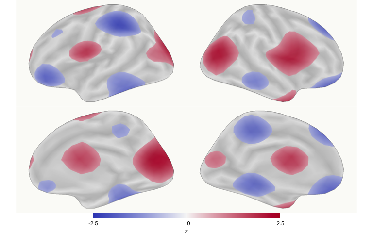

<!-- README.md is generated from README.Rmd. Please edit that file -->

# neurosurf

[](https://bbuchsbaum.r-universe.dev/neurosurf)
[Documentation](https://bbuchsbaum.github.io/neurosurf/) ·
[Reference](https://bbuchsbaum.github.io/neurosurf/reference/index.html)
· [News](NEWS.md)

neurosurf is an R package for cortical surface data. It reads
FreeSurfer, GIFTI, and AFNI/SUMA meshes, keeps vertex-wise values
attached to their geometry, and turns them into publication figures and
self-contained interactive HTML reports.

> **Status:** Pre-release (0.1.0.9001) and not on CRAN. APIs may change.

## Installation

Install a prebuilt binary from r-universe:

``` r
install.packages("neurosurf",
  repos = c("https://bbuchsbaum.r-universe.dev", "https://cloud.r-project.org")
)
```

or build the development version from GitHub (requires a C++ toolchain):

``` r
# install.packages("remotes")
remotes::install_github("bbuchsbaum/neurosurf")
```

## Quick start

Render a thresholded map on both hemispheres of the bundled fsaverage
surface:

``` r
library(neurosurf)

surf <- load_fsaverage_std8("inflated")
white <- load_fsaverage_std8("white")

# Any numeric vector with one value per vertex; here a synthetic z-map
zmap <- function(g) {
  xyz <- coords(g)
  as.numeric(scale(sin(xyz[, 2] / 18) + cos(xyz[, 3] / 14) + 0.7 * sin(xyz[, 1] / 12)))
}

fig <- surface_figure(
  lh = surf$lh, rh = surf$rh,
  values = list(lh = zmap(surf$lh), rh = zmap(surf$rh)),
  anatomy = list(lh = curvature(white$lh), rh = curvature(white$rh)),
  threshold = 1, limits = c(-2.5, 2.5), legend_title = "z"
)
plot(fig)
```



`write_surface_figure(fig, "figure.png")` saves the same figure.
Rendering runs on the CPU, so it works identically on a laptop, a
cluster node, or CI, with no OpenGL device or browser.

## What it covers

- **Read and write surfaces and data**: FreeSurfer, GIFTI, AFNI/SUMA,
  and NIML (`read_surf()`, `read_surf_geometry()`, `write_surf_data()`),
  plus bundled fsaverage templates (`load_fsaverage()`,
  `load_fsaverage_std8()`).
- **Map volumes to surfaces**: sample a volumetric image onto a mesh
  with `vol_to_surf()` or `vol_to_surf_sdf()`.
- **Analyse on the mesh**: smoothing, curvature, geodesic distances,
  neighbourhood graphs, cluster thresholding, and ROI boundaries.
- **Surface searchlights** for multivariate pattern analysis
  (`SurfaceSearchlight()`, `RandomSurfaceSearchlight()`).
- **Figures**: headless, deterministic multi-view figures
  (`surface_figure()`), and interactive rgl display (`view_surface()`).
- **Interactive reports**: combine both hemispheres and several named
  maps in one `surface_scene()`, show it with `surfwidget()` in R
  Markdown or Quarto, or write it as a standalone HTML page with
  `write_surface_scene()`. The viewer is bundled, so reports need no CDN
  or network access.

Volumetric data structures come from
[neuroim2](https://github.com/bbuchsbaum/neuroim2).

## Documentation

- [Introduction to neurosurf data
  structures](https://bbuchsbaum.github.io/neurosurf/articles/introduction-to-neurosurf.html):
  geometry, vertex data, and the core classes.
- [Publication-quality surface
  figures](https://bbuchsbaum.github.io/neurosurf/articles/surface-figures.html):
  static figures for papers.
- [Bilateral interactive surface
  reports](https://bbuchsbaum.github.io/neurosurf/articles/interactive-surfaces.html):
  browser-based reports with several maps.
- [Displaying surfaces with
  rgl](https://bbuchsbaum.github.io/neurosurf/articles/displaying-surfaces.html):
  interactive exploration from an R session.
- [Function
  reference](https://bbuchsbaum.github.io/neurosurf/reference/index.html).

## Contributing

See [CONTRIBUTING.md](CONTRIBUTING.md), including how to rebuild the
bundled JavaScript viewer. Bug reports go to the [issue
tracker](https://github.com/bbuchsbaum/neurosurf/issues).

## License

GPL (\>= 2)
