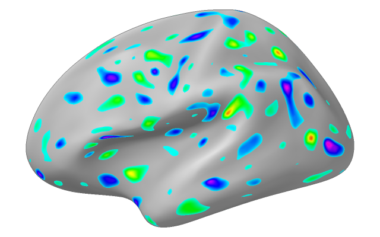

# Displaying Surfaces with RGL

This vignette shows how to display cortical geometry, curvature, and
vertex values with RGL. It uses the small `std.8` surfaces bundled with
neurosurf; no downloads or browser processes are needed to build the
article. The first figure is an interactive RGL scene. The later static
illustrations use neurosurf’s CPU renderer, rather than RGL snapshots,
to keep the installed vignette compact and usable on machines without
OpenGL.

## Open a scene and close it when finished

[`view_surface()`](https://bbuchsbaum.github.io/neurosurf/reference/view_surface.md)
draws into the current RGL device when `new_window = FALSE`. This small
helper gives each example a private NULL device and closes it even if
the plotting call fails. A NULL device records a scene for WebGL without
opening a desktop window. In an interactive session, use `open3d()` to
open a normal RGL window instead.

``` r

with_rgl_scene <- function(code) {
  device <- rgl::open3d(useNULL = TRUE)
  on.exit(rgl::close3d(device), add = TRUE)
  force(code)
}
```

A `SurfaceGeometry` records its hemisphere, so `viewpoint = "lateral"`
selects the appropriate left or right view. Drag the scene to rotate it.

``` r

with_rgl_scene({
  view_surface(left, viewpoint = "lateral", bgcol = "lightgray",
               new_window = FALSE)
  rgl::rglwidget()
})
```

## Curvature and scalar overlays

Curvature distinguishes gyri from sulci.
[`curv_cols_smooth()`](https://bbuchsbaum.github.io/neurosurf/reference/curv_cols_smooth.md)
turns it into a gray background; pass vertex values separately in
`vals`. `irange` sets the color scale, and `thresh = c(-1, 1)` makes
values inside that band transparent. Each vector must have one entry per
vertex.

``` r

with_rgl_scene({
  view_surface(left, vals = vertex_values, cmap = rainbow(256),
               irange = c(-3, 3), thresh = c(-1, 1),
               bgcol = curv_cols_smooth(curv), viewpoint = "lateral",
               specular = "black", new_window = FALSE)
  invisible(NULL)
})
```

For a deterministic static illustration of the same values and
threshold, use
[`render_surface_rgba()`](https://bbuchsbaum.github.io/neurosurf/reference/render_surface_rgba.md).
Its lighting and color mapping are independent of RGL; this is a CPU
rendering, not a screenshot of the preceding scene.

``` r

panel <- render_surface_rgba(
  left, vertex_values, anatomy_metric = curv,
  camera = "lateral", threshold = 1, limits = c(-3, 3),
  palette = rainbow(256), width = 640, height = 400, antialias = 2
)
```



## Vertex colors, transparency, and material

`vert_clrs` supplies explicit colors and overrides scalar color mapping.
`alpha` controls opacity; `specular = "black"` gives a matte surface,
while other colors add highlights. Here the lower half of the x
coordinates is blue and the upper half is red.

``` r

x <- coords(left)[, 1]
colors <- ifelse(x > median(x), "#FF0000", "#0000FF")
with_rgl_scene({
  view_surface(left, vert_clrs = colors, alpha = 0.6,
               viewpoint = "ventral", specular = "black",
               new_window = FALSE)
  invisible(NULL)
})
```

The `lit` argument controls whether lighting affects the material. These
choices change the displayed scene, not the stored geometry or vertex
data.

## Change viewpoints and combine hemispheres

Supported views include `"lateral"`, `"medial"`, `"ventral"`, and
`"posterior"`. Lateral views of opposite hemispheres face different
orientations, so use separate panels for them. For a posterior view,
both hemispheres can share one scene because their coordinates separate
along x.

``` r

with_rgl_scene({
  view_surface(left, viewpoint = "posterior", offset = c(-5, 0, 0),
               bgcol = curv_cols_smooth(curvature(left)),
               new_window = FALSE)
  view_surface(right, viewpoint = "posterior", offset = c(5, 0, 0),
               bgcol = curv_cols_smooth(curvature(right)),
               new_window = FALSE)
  invisible(NULL)
})
```

For static multi-view output,
[`surface_figure()`](https://bbuchsbaum.github.io/neurosurf/reference/surface_figure.md)
combines hemispheres and adds labels. See
[`vignette("surface-figures")`](https://bbuchsbaum.github.io/neurosurf/articles/surface-figures.md)
for a full workflow.

## Add markers and plot surface data objects

Markers can refer to vertices, with a radius and color for each marker.
These three markers use deterministic vertex indices.

``` r

markers <- data.frame(vertex = c(10, 100, 300), radius = 4.5,
                      color = c("yellow", "cyan", "magenta"))
with_rgl_scene({
  view_surface(left, spheres = markers, spheres_as_vertices = TRUE,
               bgcol = curv_cols_smooth(curv), viewpoint = "lateral",
               new_window = FALSE)
  invisible(NULL)
})
```

`NeuroSurface` stores values and their vertex indices. Its
[`plot()`](https://rdrr.io/r/graphics/plot.default.html) method passes
them to the same rendering machinery, so you can override color,
threshold, opacity, and viewpoint in the plotting call.

``` r

surface <- NeuroSurface(left, indices = seq_along(vertex_values),
                        data = vertex_values)
with_rgl_scene({
  plot(surface, cmap = heat.colors(128), irange = c(-3, 3),
       viewpoint = "lateral", new_window = FALSE)
  invisible(NULL)
})
```

## Smooth and threshold an activation map

Smoothing and cluster-size thresholding operate on surface data before
rendering. This synthetic map is an illustration of the workflow, not a
statistical inference result.

``` r

smoothed <- smooth(surface)
clustered <- cluster_threshold(smoothed, size = 30,
                               threshold = c(-0.2, 0.2))
with_rgl_scene({
  plot(clustered, cmap = rainbow(100), irange = c(-3, 3),
       thresh = c(-0.2, 0.2), new_window = FALSE)
  invisible(NULL)
})
```

[`surface_montage()`](https://bbuchsbaum.github.io/neurosurf/reference/surface_montage.md)
accepts a list of surfaces or `list(surface, ...overrides)` panels. Its
static RGL captures require a rendering backend. For example, run this
in a session where RGL snapshots are available:

``` r

surface_montage(
  list(smoothed, list(smoothed, thresh = c(-0.2, 0.2)),
       list(clustered, thresh = c(-0.2, 0.2))),
  cmap = rainbow(100), irange = c(-3, 3), ncol = 3
)
```

## Save an RGL snapshot

[`snapshot_surface()`](https://bbuchsbaum.github.io/neurosurf/reference/snapshot_surface.md)
saves a PNG through the available RGL rendering backend. On a NULL
device, it requires webshot2 and a headless browser. It may return an
empty path when no usable snapshot is available. The following is an
interactive export recipe; building this article does not launch a
browser.

``` r

file <- tempfile(fileext = ".png")
path <- snapshot_surface(left, file = file, vals = vertex_values,
                         cmap = rainbow(256), viewpoint = "lateral")
if (length(path)) {
  png::readPNG(path)
}
unlink(file)
```

For browser-free PNG output, use the CPU renderer shown above. For
authored interactive reports with multiple selectable maps, see
[`vignette("interactive-surfaces")`](https://bbuchsbaum.github.io/neurosurf/articles/interactive-surfaces.md).

The bundled templates retain the FreeSurfer terms in
`system.file("extdata", "LICENSE-FreeSurfer.txt", package = "neurosurf")`.
