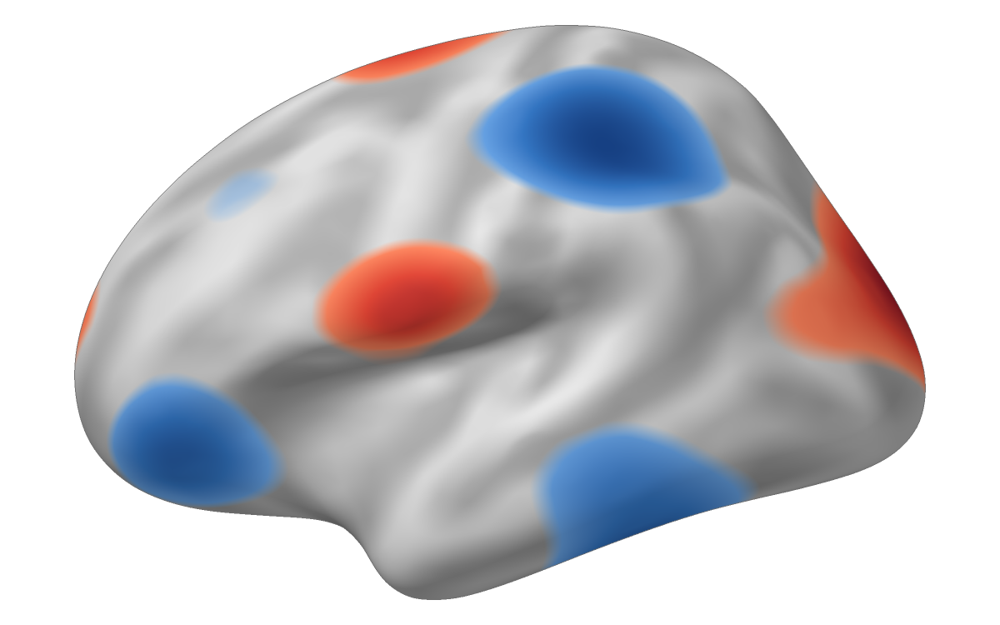
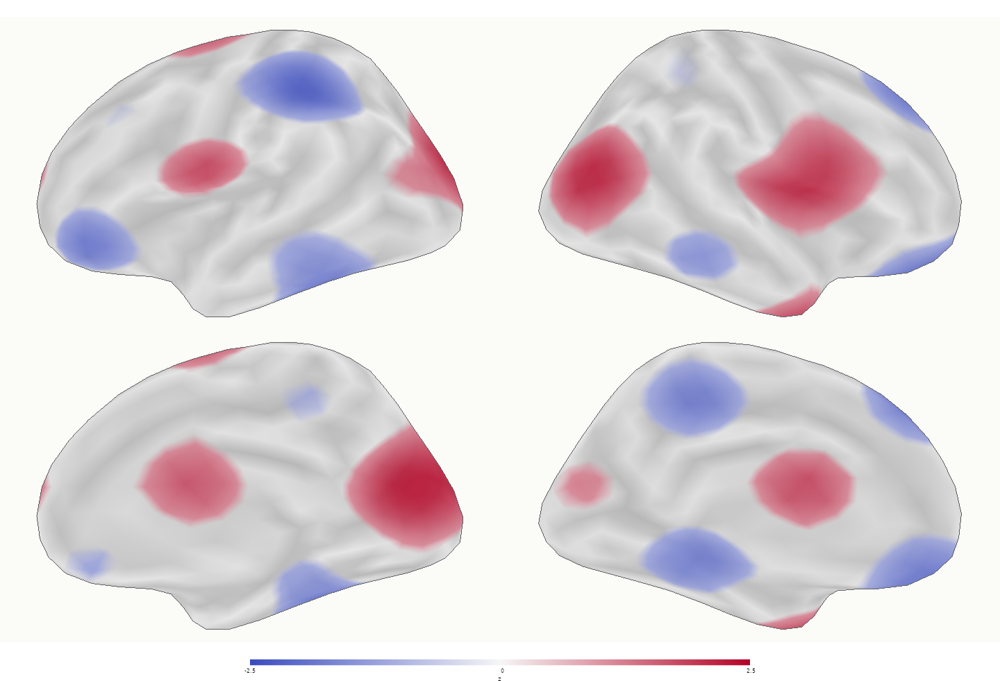

# Publication-quality continuous surface figures

You have a continuous value at every cortical vertex–for example a *t*,
*z*, thickness, or connectivity map–and need a static figure that
remains scientifically interpretable after thresholding. The important
distinction is that the value is a **field on a triangle mesh**, not a
parcel label. A polished figure should therefore interpolate the scalar
within each triangle, test visibility with a real depth buffer, and add
anatomy without drawing atlas or occlusion lines over the result.

Two functions cover this task.
[`surface_figure()`](https://bbuchsbaum.github.io/neurosurf/reference/surface_figure.md)
renders both hemispheres from several views and returns one finished
figure with a shared colour bar;
[`write_surface_figure()`](https://bbuchsbaum.github.io/neurosurf/reference/write_surface_figure.md)
writes it to PNG. Underneath it,
[`render_surface_rgba()`](https://bbuchsbaum.github.io/neurosurf/reference/render_surface_rgba.md)
is the deterministic, headless single-panel primitive: it returns an
RGBA raster plus diagnostic buffers and provenance, and
[`write_surface_rgba()`](https://bbuchsbaum.github.io/neurosurf/reference/write_surface_rgba.md)
writes one panel to PNG. Both run identically in CI, on a cluster, and
on a laptop, with no OpenGL and no browser.

## What are the inputs?

You need a display geometry and one numeric value per vertex. For
anatomical context, use a curvature or sulcal-depth metric from a
corresponding white, pial, or midthickness surface rather than computing
curvature on the inflated display shape.

The package includes matching decimated fsaverage surfaces, which keep
this example fast and offline.

``` r

inflated <- load_fsaverage_std8("inflated")

read_geom <- function(name) {
  read_surf_geometry(system.file("extdata", name, package = "neurosurf"))
}
white_lh <- read_geom("std.8_lh.white.asc")
white_rh <- read_geom("std.8_rh.white.asc")
```

Here a smooth coordinate-based field stands in for your measured
statistic. The renderer treats it exactly like any other vertex-wise
numeric vector.

``` r

example_statistic <- function(geometry) {
  xyz <- coords(geometry)
  value <- sin(xyz[, 2] / 18) + cos(xyz[, 3] / 14) +
    0.7 * sin(xyz[, 1] / 12)
  as.numeric(scale(value))
}

stat_lh <- example_statistic(inflated$lh)
stat_rh <- example_statistic(inflated$rh)
```

## How do you render one thresholded view?

Choose the threshold and colour limits as scientific inputs. In this
example, the colour scale stays fixed at `[-2.5, 2.5]`, while an opacity
ramp softens only the visual transition immediately above `|z| = 1`.

``` r

lh_lateral <- render_surface_rgba(
  inflated$lh,
  vertex_values = stat_lh,
  anatomy_metric = curv_lh,
  camera = "lateral",
  threshold = 1,
  tail = "two_sided",
  limits = c(-2.5, 2.5),
  alpha_ramp = 0.25,
  antialias = 2
)
```



The colour at each covered sample comes from the barycentrically
interpolated scalar. Thresholding and palette mapping happen after that
interpolation, so a threshold boundary may cross a triangle instead of
jumping from one mesh edge to the next. The per-sample z-buffer
independently decides which folded surface fragment is visible.

## How do you build the four canonical views?

[`surface_figure()`](https://bbuchsbaum.github.io/neurosurf/reference/surface_figure.md)
renders every hemisphere-view combination with one shared threshold,
colour limit, and palette, and adds the colour bar. The camera contract
is explicit: `camera_mode = "canonical"` is strict orthographic output,
while `"presentation"` adds a small declared obliquity.

``` r

figure <- surface_figure(
  lh = inflated$lh,
  rh = inflated$rh,
  values = list(lh = stat_lh, rh = stat_rh),
  anatomy = list(lh = curv_lh, rh = curv_rh),
  views = c("lateral", "medial"),
  threshold = 1,
  tail = "two_sided",
  limits = c(-2.5, 2.5),
  alpha_ramp = 0.25,
  legend_title = "z",
  panel_width = 720,
  panel_height = 450,
  antialias = 2
)
```



In an interactive session, `plot(figure)` draws the same figure on the
current graphics device.

The lateral and medial views differ because each panel rasterizes the
visible triangles from its own camera. Internal sulcal occlusion edges
are not drawn as outlines; `outer_contour = TRUE` marks only cortex
touching background that is connected to the image exterior.

## Where do the medial wall and cortex mask enter?

A real cortex mask is a separate domain object, not a consequence of
parcel value zero. Pass one logical value per vertex. Triangles touching
a masked vertex never receive overlay colour. `medial_wall` then
controls whether the excluded domain is quietly shaded, omitted, or
outlined.

``` r

masked_panel <- render_surface_rgba(
  inflated$lh,
  vertex_values = statistic,
  anatomy_metric = white_surface_curvature,
  cortex_mask = cortex_label,
  medial_wall = "shade"
)
```

Atlas-aware callers such as `neuroatlas::plot_brain()` can resolve the
mask and its provenance from an atlas annotation. At this low level,
neurosurf requires the caller to supply the domain explicitly rather
than guessing that an atlas label of zero always means medial wall.

## How should a volume become a continuous surface field?

For a continuous image, use explicit trilinear sampling through the
cortical ribbon. Interpolation, aggregation across depth, and tangential
smoothing are separate choices. The following contract samples five
depths, averages them, and applies no surface smoothing:

``` r

mapped <- vol_to_surf(
  white_surface,
  pial_surface,
  statistic_volume,
  fun = "avg",
  sampling = "thickness",
  interpolation = "linear",
  depth = seq(0.1, 0.9, length.out = 5),
  aggregate = "mean",
  surface_smooth_fwhm = 0
)
```

Use `interpolation = "nearest"` for discrete nearest-voxel sampling. The
historical Gaussian KNN behaviour remains available as
`interpolation = "legacy"`. Categorical `aggregate = "mode"` is
intentionally incompatible with linear interpolation.

## Which function draws what you need?

Start from the output you want:

| You want | Use |
|----|----|
| A finished static figure: views by hemispheres, one colour bar | [`surface_figure()`](https://bbuchsbaum.github.io/neurosurf/reference/surface_figure.md), then [`write_surface_figure()`](https://bbuchsbaum.github.io/neurosurf/reference/write_surface_figure.md) |
| One panel, or a custom layout you compose yourself | [`render_surface_rgba()`](https://bbuchsbaum.github.io/neurosurf/reference/render_surface_rgba.md), then [`write_surface_rgba()`](https://bbuchsbaum.github.io/neurosurf/reference/write_surface_rgba.md) |
| To rotate and inspect a map on your desktop during analysis | [`view_surface()`](https://bbuchsbaum.github.io/neurosurf/reference/view_surface.md) |
| An interactive figure in an HTML report or Shiny app | [`surfwidget()`](https://bbuchsbaum.github.io/neurosurf/reference/surfwidget-methods.md); see [`vignette("interactive-surfaces")`](https://bbuchsbaum.github.io/neurosurf/articles/interactive-surfaces.md) |

The first two run headlessly and deterministically; the last two are
interactive sessions.

Two companion packages build on the same renderer, so their pixels agree
with the figures here: `neuroatlas::plot_brain()` adds atlas-derived
masks, labels, and orientation marks, and `neuromosaic::surf_montage()`
starts from a statistic volume rather than vertex values. Atlas outlines
belong in figures about the atlas; the default continuous-statistic view
omits them.

## Next steps

- [`vignette("displaying-surfaces")`](https://bbuchsbaum.github.io/neurosurf/articles/displaying-surfaces.md)
  covers lower-level RGL rendering and local snapshots.
- [`vignette("interactive-surfaces")`](https://bbuchsbaum.github.io/neurosurf/articles/interactive-surfaces.md)
  builds interactive bilateral report widgets with
  [`surfwidget()`](https://bbuchsbaum.github.io/neurosurf/reference/surfwidget-methods.md).
- [`vignette("introduction-to-neurosurf")`](https://bbuchsbaum.github.io/neurosurf/articles/introduction-to-neurosurf.md)
  introduces `SurfaceGeometry`, `NeuroSurface`, and related data
  structures.
- [`?surface_figure`](https://bbuchsbaum.github.io/neurosurf/reference/surface_figure.md),
  [`?render_surface_rgba`](https://bbuchsbaum.github.io/neurosurf/reference/render_surface_rgba.md),
  [`?surface_threshold_segments`](https://bbuchsbaum.github.io/neurosurf/reference/surface_threshold_segments.md),
  and
  [`?vol_to_surf`](https://bbuchsbaum.github.io/neurosurf/reference/vol_to_surf.md)
  document the complete computational contracts.
