# Displaying Surfaces with RGL

This vignette demonstrates how to display 3D brain surface meshes using
the `rgl` plotting tools provided by the `neurosurf` package, primarily
through the [`plot()`](https://rdrr.io/r/graphics/plot.default.html)
method which utilizes the
[`view_surface()`](../reference/view_surface.md) function internally.

For interactive HTML widgets, see *Interactive Surface Visualization
with surfwidget*. For high-level, surfplot-style multi-view layouts with
shared colourbars and atlas outlines, see *Surfplot-style Figures with
neurosurf*.

## Setup and Loading Data

First, we set up `knitr` options to embed `rgl` plots directly into the
HTML output using WebGL and prevent standalone `rgl` windows from
popping up during knitting. We then load example left and right
hemisphere white matter surfaces included with the package and prepare
some data (smoothed geometry, curvature, random values) for the
examples.

## Basic Surface Plotting

The simplest way to display a `SurfaceGeometry` object is using the
[`plot()`](https://rdrr.io/r/graphics/plot.default.html) method. By
default, it renders the surface with a light gray background. We can
specify a `viewpoint`.

``` r
# Plot the smoothed left hemisphere from a lateral viewpoint
render_surface(white_lh_display, viewpoint = "lateral", lit = TRUE)
```

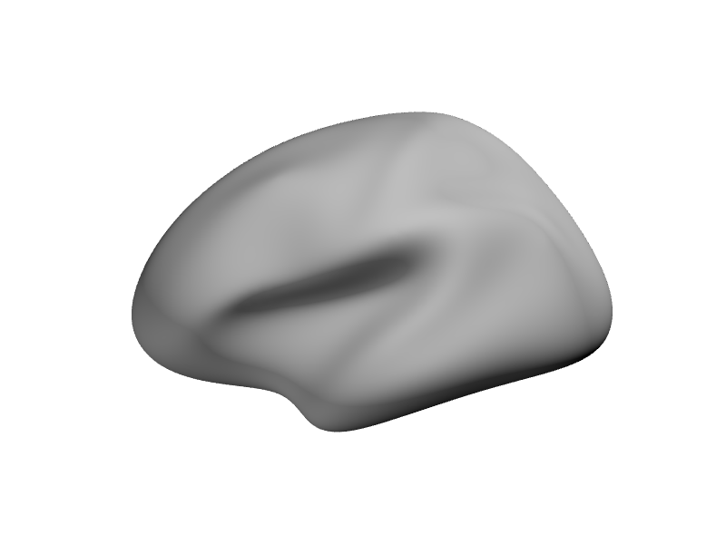

## Coloring Based on Curvature

Surface curvature helps distinguish gyri (outward folds) from sulci
(inward folds). The [`curvature()`](../reference/curvature-methods.md)
function calculates this, and
[`curv_cols_smooth()`](../reference/curv_cols_smooth.md) maps the values
to a continuous grayscale gradient (dark in sulci, light on gyri) for
natural-looking shading. For a simpler binary split, see
[`curv_cols()`](../reference/curv_cols.md). Either way, pass the
resulting colors to the `bgcol` argument of
[`plot()`](https://rdrr.io/r/graphics/plot.default.html).

``` r
# Calculate curvature colors
curv_colors <- curv_cols_smooth(curv_lh_display)

# Plot with curvature background from a medial viewpoint
render_surface(white_lh_display, bgcol = curv_colors, viewpoint = "medial", specular = "black")
```

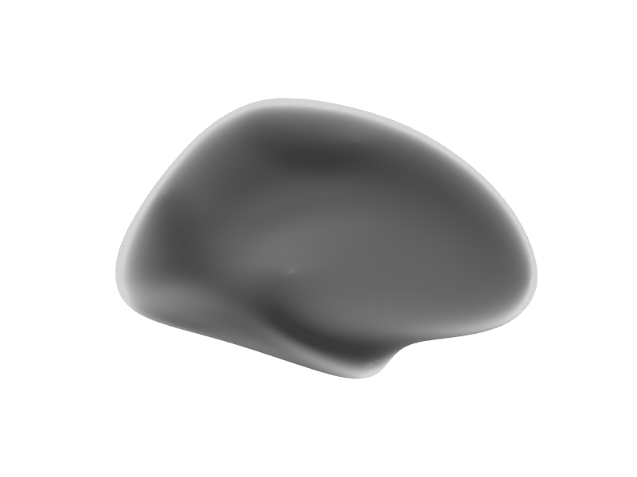

## Overlaying Data Values

Often, we want to visualize data mapped onto the surface vertices (e.g.,
activation values, thickness). We can pass a vector of values to the
`vals` argument. The `cmap` argument specifies the color map, and
`irange` defines the data range to map onto the colormap. Values outside
`irange` are clamped to the minimum or maximum color.

``` r
# Overlay random data using a rainbow colormap
# Map data range from -2 to 2 onto the colormap
render_surface(white_lh_display, vals = random_vals_display_smooth, cmap = rainbow(256),
               irange = c(-2, 2), thresh = NULL, viewpoint = "lateral", specular = "gray")
```

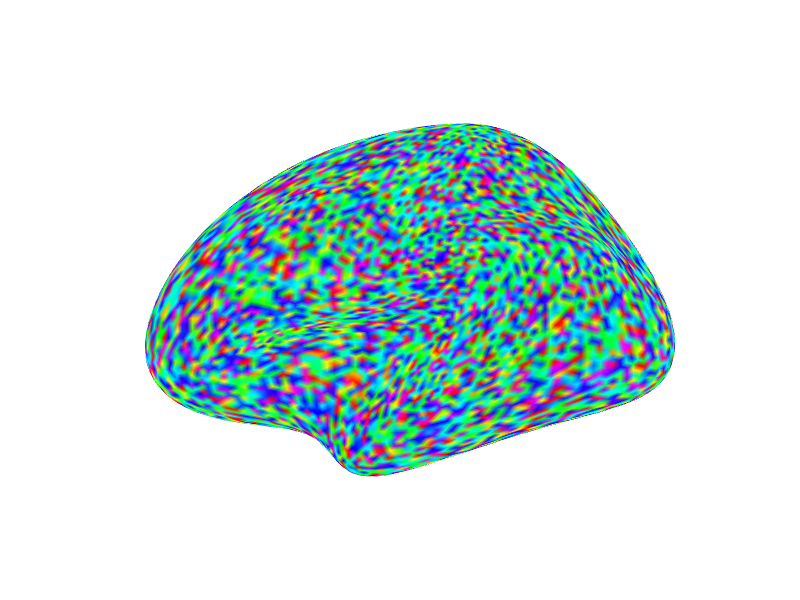

## Thresholding Data Visualization

The `thresh` argument (a vector of two values, `c(lower, upper)`) can be
used with `vals` to make parts of the surface transparent. Vertices
where the corresponding value in `vals` is *inside* this range (between
`lower` and `upper`) are rendered transparently; values outside remain
opaque. This is useful for masking out a band of values.

``` r
# Same data overlay as above, but make values between -1 and 1 transparent
render_surface(white_lh_display, vals = random_vals_display_smooth, cmap = rainbow(256),
               irange = c(-2, 2), thresh = c(-1, 1), viewpoint = "lateral", lit = TRUE)
```

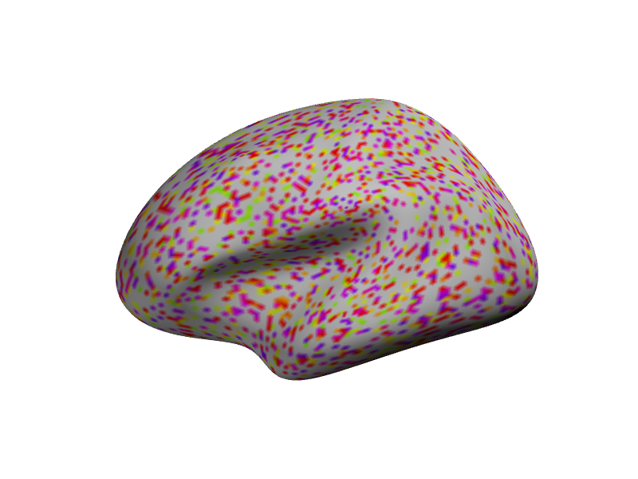

## Direct Vertex Coloring

Instead of mapping data values to a colormap, you can provide a vector
of specific hex color codes directly to the `vert_clrs` argument. This
overrides `vals` and `cmap`. The vector length must match the number of
vertices.

``` r
# Color vertices based on their x-coordinate (e.g., red for positive x, blue for negative)
x_coords <- coords(white_lh_display)[, 1]
vertex_colors <- ifelse(x_coords > median(x_coords), "#FF0000", "#0000FF") # Red/Blue

render_surface(white_lh_display, vert_clrs = vertex_colors, viewpoint = "ventral", lit = TRUE)
```

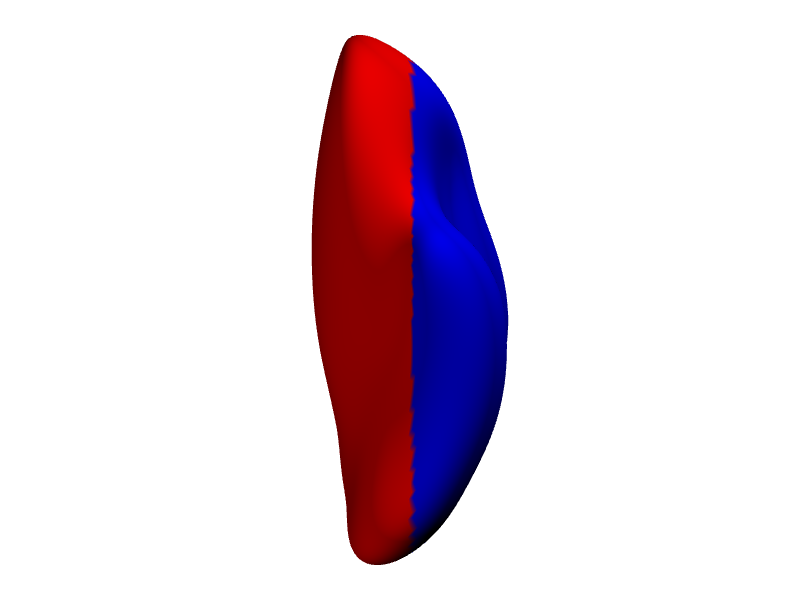

## Controlling Transparency

The `alpha` argument controls the overall transparency of the surface,
ranging from 0 (fully transparent) to 1 (fully opaque).

``` r
# Plot the surface with 60% opacity (40% transparent)
render_surface(white_lh_display, vals = random_vals_display_smooth, cmap = heat.colors(256),
               irange = c(-2, 2), alpha = 0.6, viewpoint = "posterior")
```

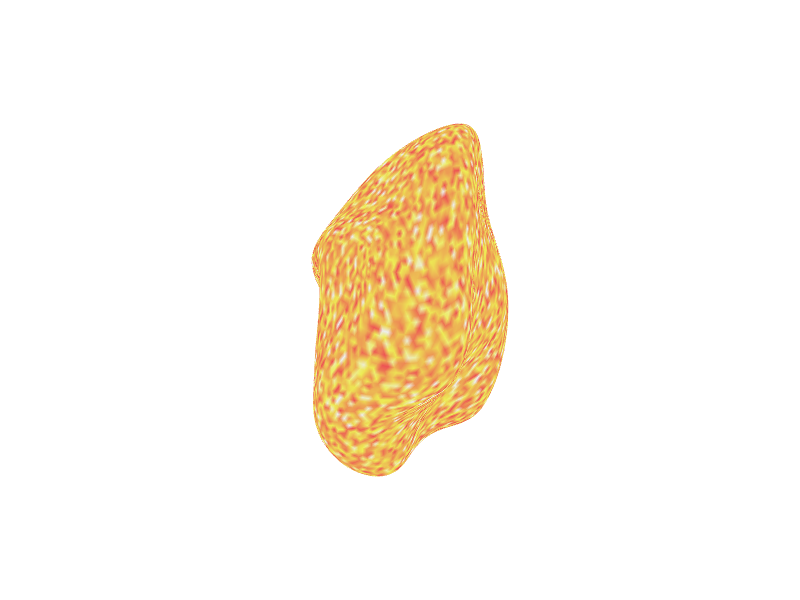

## Adjusting Lighting and Material

The appearance of the surface is affected by lighting. The `specular`
argument controls the color of specular highlights (shininess). Setting
it to `"black"` creates a matte appearance.

``` r
# Plot with a matte finish (no specular highlights)
render_surface(white_lh_display, vals = random_vals_display_smooth, cmap = topo.colors(256),
               irange = c(-2, 2), specular = "black", viewpoint = "lateral", lit = TRUE)
```

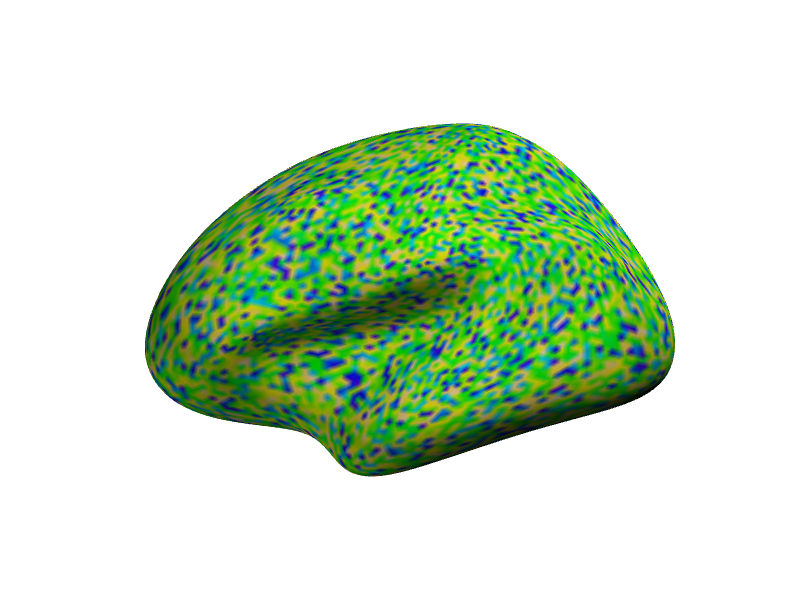

## Snapshotting to an image (for knitr/CI)

Use to render an off-screen PNG and include it directly:

``` r
.render_counter$n <- .render_counter$n + 1
snapshot_file <- knitr::fig_path(paste0("-snapshot-", .render_counter$n, ".png"))
dir.create(dirname(snapshot_file), recursive = TRUE, showWarnings = FALSE)

img_path <- try(snapshot_surface(white_lh_display,
                                 file = snapshot_file,
                                 vals = random_vals_display_smooth,
                                 cmap = viridis::viridis(256),
                                 viewpoint = "lateral",
                                 specular = "black",
                                 width = 1200, height = 900),
                silent = TRUE)

if (!inherits(img_path, "try-error") && is.character(img_path) && file.exists(img_path)) {
  knitr::include_graphics(img_path)
} else {
  cat("*(Snapshot unavailable in this build environment)*")
}
```

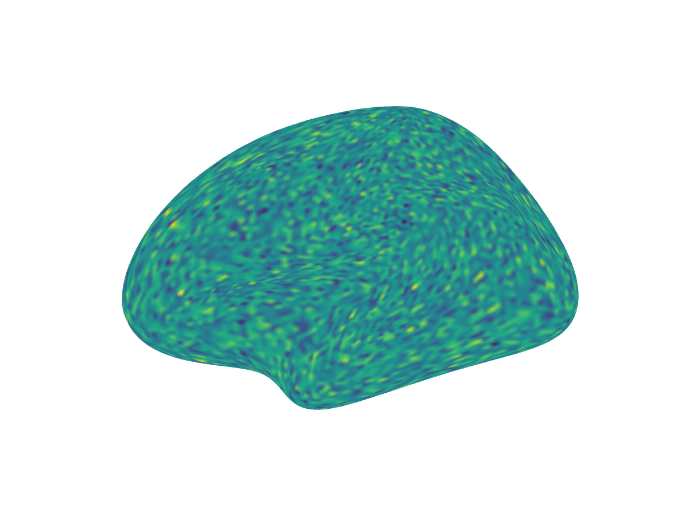

## Changing Viewpoints

The `viewpoint` argument can be set to common anatomical views like
`"lateral"`, `"medial"`, `"ventral"`, or `"posterior"`. The function
automatically selects the correct left/right version based on the
surface’s hemisphere information (`surf@hemi`).

``` r
# Display multiple viewpoints with curvature shading
render_multi_view(white_lh_display,
                  viewpoints = c("lateral", "medial", "ventral", "posterior"),
                  bgcol = curv_cols_smooth(curv_lh_display), specular = "black")
```

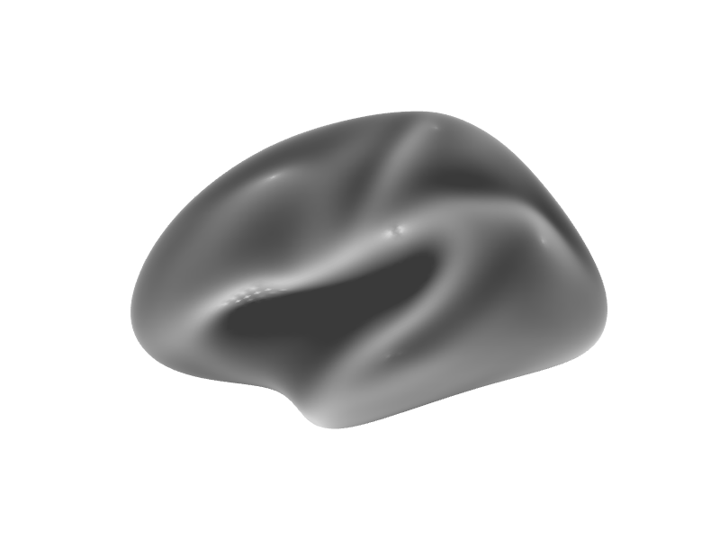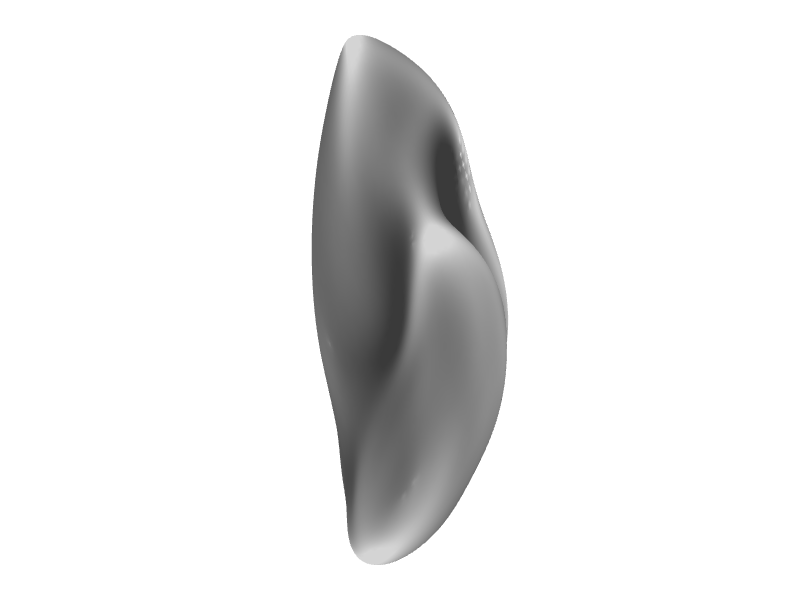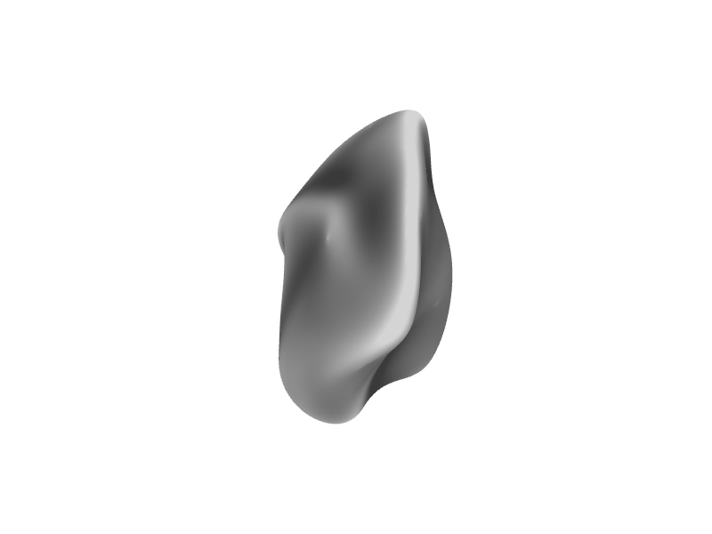

## Displaying Two Hemispheres

You can plot multiple surfaces in the same `rgl` scene. When plotting
the second surface, use `new_window = FALSE` to add it to the existing
window. You might need to use the `offset` argument to position the
second hemisphere correctly relative to the first.

``` r
# Smooth the right hemisphere and get its curvature
white_rh_smooth <- smooth(white_rh, type = "HCLaplace", delta = 0.2, iteration = 5)
curv_rh <- curvature(white_rh_smooth)

# Try snapshot approach for two hemispheres
.render_counter$n <- .render_counter$n + 1
two_hemi_file <- knitr::fig_path(paste0("-twohemi-", .render_counter$n, ".png"))
dir.create(dirname(two_hemi_file), recursive = TRUE, showWarnings = FALSE)

img_path <- try({
  file <- two_hemi_file
  rgl::open3d()
  rgl::par3d(windowRect = c(0, 0, 1200, 600))
  rgl::bg3d(color = "white")

  # Plot LH with curvature background

  view_surface(white_lh_display, bgcol = curv_cols_smooth(curv_lh_display),
               viewpoint = "lateral", new_window = FALSE)
  # Plot RH offset to the right
  view_surface(white_rh_smooth, bgcol = curv_cols_smooth(curv_rh),
               viewpoint = "lateral", new_window = FALSE, offset = c(100, 0, 0))
  # Zoom out so both hemispheres are visible
  rgl::view3d(fov = 0, zoom = 0.35,
              userMatrix = rbind(c(0,-1,0,0), c(0,0,1,0), c(-1,0,0,0), c(0,0,0,1)))

  if (rgl::rgl.useNULL() && requireNamespace("webshot2", quietly = TRUE)) {
    rgl::snapshot3d(file, webshot = TRUE)
  } else {
    rgl::rgl.snapshot(file)
  }
  rgl::close3d()
  file
}, silent = TRUE)

if (!inherits(img_path, "try-error") && file.exists(img_path)) {
  knitr::include_graphics(img_path)
} else {
  # Fallback to rglwidget
  rgl::open3d()
  view_surface(white_lh_display, bgcol = curv_cols_smooth(curv_lh_display),
               viewpoint = "lateral", new_window = FALSE)
  view_surface(white_rh_smooth, bgcol = curv_cols_smooth(curv_rh),
               viewpoint = "lateral", new_window = FALSE, offset = c(100, 0, 0))
  rgl::view3d(fov = 0, zoom = 0.35,
              userMatrix = rbind(c(0,-1,0,0), c(0,0,1,0), c(-1,0,0,0), c(0,0,0,1)))
  rgl::rglwidget()
}
```

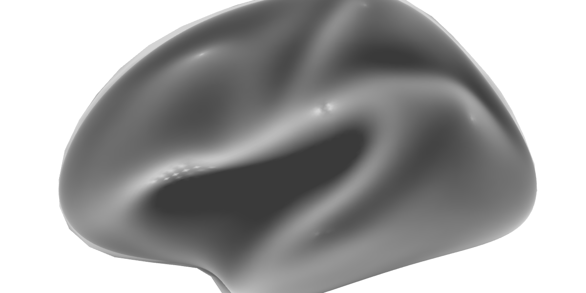

## Adding Spheres to the Surface

The `spheres` argument allows you to draw spherical markers at specified
coordinates. It requires a data frame with columns `x`, `y`, `z`, and
`radius`. An optional `color` column can specify colors for each sphere.

``` r
# Define coordinates for some spherical markers
# Sample some vertex indices safely from available vertices
n_vertices <- nrow(coords(white_lh_display))
sample_indices <- sample(1:n_vertices, size = min(3, n_vertices))

peak_coords <- data.frame(
  x = coords(white_lh_display)[sample_indices, 1],
  y = coords(white_lh_display)[sample_indices, 2],
  z = coords(white_lh_display)[sample_indices, 3],
  radius = c(3, 4, 2.5)[1:length(sample_indices)],
  color = c("yellow", "cyan", "magenta")[1:length(sample_indices)]
)

# Plot the surface with curvature shading and add the spheres
render_surface(white_lh_display, bgcol = curv_cols_smooth(curv_lh_display),
               viewpoint = "lateral", specular = "black", spheres = peak_coords)
```

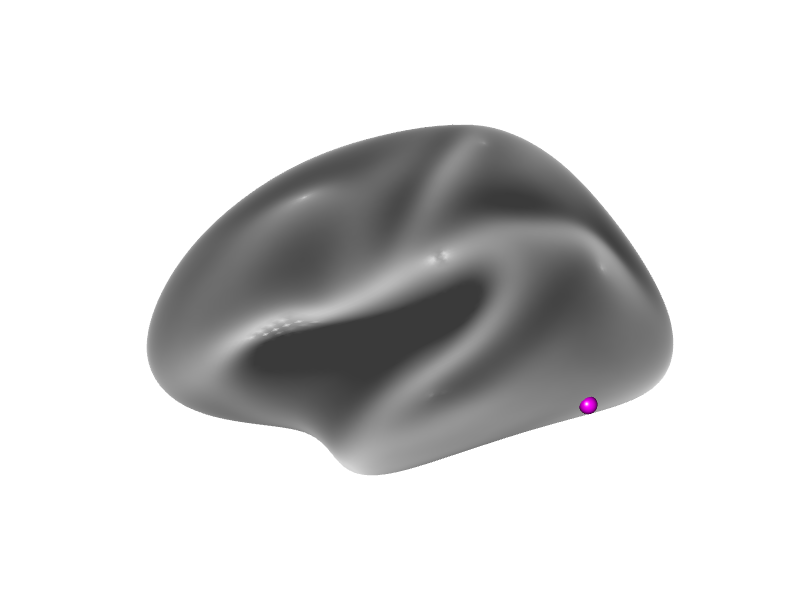

## Plotting Other NeuroSurface Objects

The [`plot()`](https://rdrr.io/r/graphics/plot.default.html) method also
works for other classes like `NeuroSurface`, `LabeledNeuroSurface`, and
`ColorMappedNeuroSurface`. These objects already contain data and
potentially color mapping information. The `plot` method extracts this
information and passes the appropriate arguments (like `vals`, `cmap`,
`irange`, `thresh`, `vert_clrs`) to the underlying `view_surface`
function.

``` r
# Create a NeuroSurface object with the random data
nsurf <- NeuroSurface(white_lh_display, indices = 1:length(random_vals_display), data = random_vals_display)

# Plot the NeuroSurface - uses data stored within the object
# We can still override or add parameters like cmap, irange, thresh, alpha etc.
render_surface(geometry(nsurf), vals = values(nsurf), cmap = heat.colors(128),
               irange = c(-2.5, 2.5), viewpoint = "lateral")
```

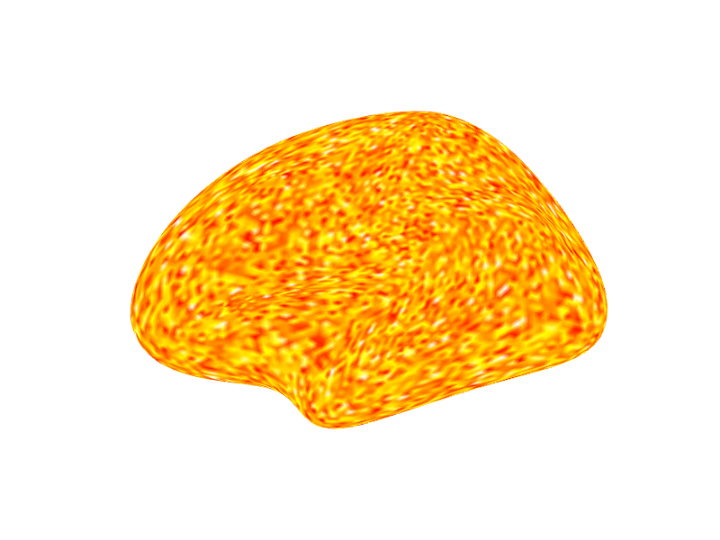

## Showing an activation map overlaid on a surface mesh

We will plot surface in a row of 3. We generate a set of random values
and then smooth those values along the surface to approximate a
realistic activation pattern.

In the first column we display all the values in the map. Next we
threshold all values between (-2,2). In the last panel we additionally
add a cluster size threshold of 30 nodes.

``` r
vals <- rnorm(length(nodes(white_lh_base)))
surf <- NeuroSurface(white_lh_base, indices = 1:length(vals), data = vals)
ssurf <- smooth(surf)

# Generate proper figure paths
.render_counter$n <- .render_counter$n + 1
act_file1 <- knitr::fig_path(paste0("-actmap-", .render_counter$n, ".png"))
.render_counter$n <- .render_counter$n + 1
act_file2 <- knitr::fig_path(paste0("-actmap-", .render_counter$n, ".png"))
.render_counter$n <- .render_counter$n + 1
act_file3 <- knitr::fig_path(paste0("-actmap-", .render_counter$n, ".png"))
dir.create(dirname(act_file1), recursive = TRUE, showWarnings = FALSE)

# Panel 1: All values
img1 <- try(snapshot_surface(geometry(ssurf), file = act_file1, vals = values(ssurf), cmap = rainbow(100),
                              irange = c(-2, 2), width = 600, height = 450), silent = TRUE)

# Panel 2: Thresholded (values between -0.2 and 0.2 transparent)
comp <- conn_comp(ssurf, threshold = c(-0.2, 0.2))
img2 <- try(snapshot_surface(geometry(ssurf), file = act_file2, vals = values(ssurf), cmap = rainbow(100),
                              irange = c(-2, 2), thresh = c(-0.2, 0.2), width = 600, height = 450), silent = TRUE)

# Panel 3: Cluster thresholded (minimum cluster size of 30)
csurf <- cluster_threshold(ssurf, size = 30, threshold = c(-0.2, 0.2))
img3 <- try(snapshot_surface(geometry(csurf), file = act_file3, vals = values(csurf), cmap = rainbow(100),
                              irange = c(-2, 2), thresh = c(-0.2, 0.2), width = 600, height = 450), silent = TRUE)

# Check if all snapshots succeeded
valid <- sapply(list(img1, img2, img3), function(p) !inherits(p, "try-error") && length(p) > 0 && file.exists(p))

if (all(valid)) {
  knitr::include_graphics(c(img1, img2, img3))
} else {
  # Fallback to rglwidget
  rgl::open3d()
  rgl::mfrow3d(1, 3, byrow = TRUE)
  view_surface(geometry(ssurf), vals = values(ssurf), cmap = rainbow(100),
               irange = c(-2, 2), new_window = FALSE)
  rgl::next3d()
  view_surface(geometry(ssurf), vals = values(ssurf), cmap = rainbow(100),
               irange = c(-2, 2), thresh = c(-0.2, 0.2), new_window = FALSE)
  rgl::next3d()
  view_surface(geometry(csurf), vals = values(csurf), cmap = rainbow(100),
               irange = c(-2, 2), thresh = c(-0.2, 0.2), new_window = FALSE)
  rgl::rglwidget()
}
```

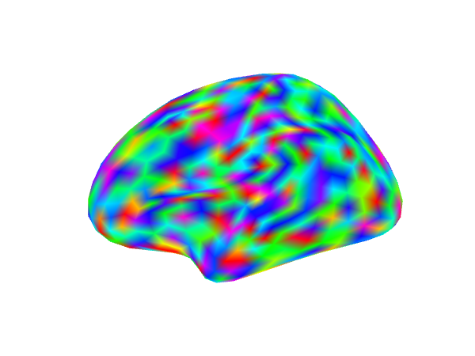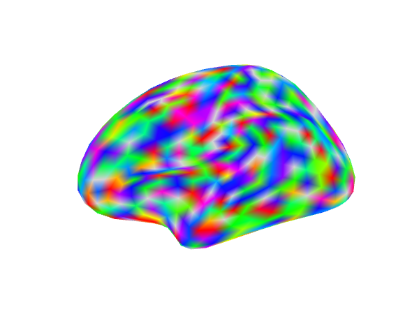

## Showing two hemispheres in same scene

``` r
# Two hemispheres shown from posterior viewpoint
.render_counter$n <- .render_counter$n + 1
posterior_file <- knitr::fig_path(paste0("-posterior-", .render_counter$n, ".png"))
dir.create(dirname(posterior_file), recursive = TRUE, showWarnings = FALSE)

img_path <- try({
  file <- posterior_file
  rgl::open3d()
  rgl::par3d(windowRect = c(0, 0, 1200, 600))
  rgl::bg3d(color = "white")

  view_surface(white_lh_display, bgcol = curv_cols_smooth(curv_lh_display),
               viewpoint = "posterior", new_window = FALSE)
  view_surface(white_rh_smooth, bgcol = curv_cols_smooth(curv_rh),
               viewpoint = "posterior", new_window = FALSE, offset = c(100, 0, 0))
  rgl::view3d(fov = 0, zoom = 0.35,
              userMatrix = rbind(c(1,0,0,0), c(0,0,1,0), c(0,-1,0,0), c(0,0,0,1)))

  if (rgl::rgl.useNULL() && requireNamespace("webshot2", quietly = TRUE)) {
    rgl::snapshot3d(file, webshot = TRUE)
  } else {
    rgl::rgl.snapshot(file)
  }
  rgl::close3d()
  file
}, silent = TRUE)

if (!inherits(img_path, "try-error") && file.exists(img_path)) {
  knitr::include_graphics(img_path)
} else {
  # Fallback to rglwidget
  rgl::open3d()
  view_surface(white_lh_display, bgcol = curv_cols_smooth(curv_lh_display),
               viewpoint = "posterior", new_window = FALSE)
  view_surface(white_rh_smooth, bgcol = curv_cols_smooth(curv_rh),
               viewpoint = "posterior", new_window = FALSE, offset = c(100, 0, 0))
  rgl::view3d(fov = 0, zoom = 0.35,
              userMatrix = rbind(c(1,0,0,0), c(0,0,1,0), c(0,-1,0,0), c(0,0,0,1)))
  rgl::rglwidget()
}
```

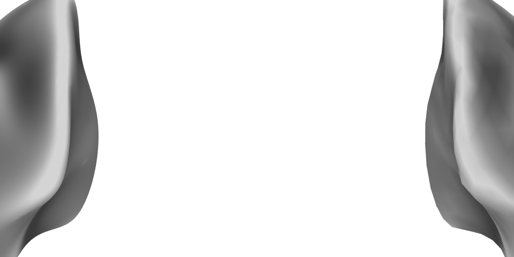

## Next Steps

For **interactive 3D visualization** with
[`surfwidget()`](../reference/surfwidget-methods.md), see
[`vignette("interactive-surfaces")`](../articles/interactive-surfaces.md).

For **publication-quality multi-view figures**, see
[`vignette("surfplot-style-figures")`](../articles/surfplot-style-figures.md).
