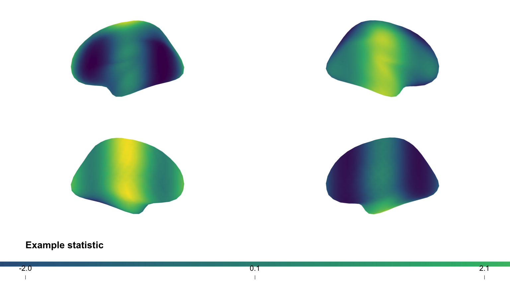
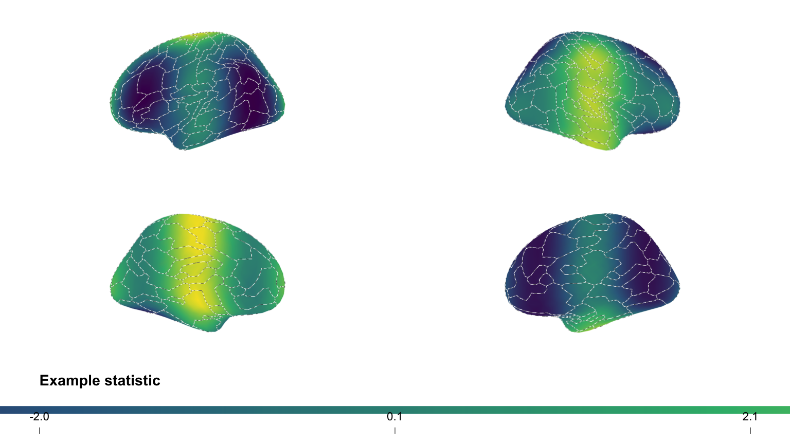

# Publication-quality surface figures

This vignette builds a multi-view, publication-ready surface figure from
fsaverage surfaces and an atlas, using neurosurf’s high-level plotting
API: [`surface_plot()`](../reference/surface_plot.md),
[`add_surface_layer()`](../reference/add_surface_layer.md),
[`add_atlas_outline()`](../reference/add_atlas_outline.md), and
[`draw_surface_plot()`](../reference/draw_surface_plot.md).

We will:

- load the bundled fsaverage `std.8` surfaces;
- map a Schaefer 200-parcel atlas from MNI152 volume space onto the
  surface;
- overlay a continuous statistical map with a colourbar; and
- add crisp atlas outlines for anatomical reference.

## Load surfaces and an atlas

The package ships decimated fsaverage surfaces (`std.8`). We use the
**inflated** surfaces for display, and the **white**/**pial** surfaces
to project the atlas from the volume onto the surface.

``` r
fs_infl <- load_fsaverage_std8("inflated")
lh <- fs_infl$lh
rh <- fs_infl$rh

read_geom <- function(name) {
  read_surf_geometry(system.file("extdata", name, package = "neurosurf"))
}
lh_white <- read_geom("std.8_lh.white.asc")
lh_pial  <- read_geom("std.8_lh.pial.asc")
rh_white <- read_geom("std.8_rh.white.asc")
rh_pial  <- read_geom("std.8_rh.pial.asc")
```

[`vol_to_surf()`](../reference/vol_to_surf.md) maps each surface vertex
to the most common atlas label among the voxels between the white and
pial surfaces, giving a per-vertex parcel id for each hemisphere.

``` r
atlas <- neuroim2::read_vol(system.file(
  "extdata",
  "Schaefer2018_200Parcels_7Networks_order_FSLMNI152_1mm.nii.gz",
  package = "neurosurf"
))

lh_parcels <- as.integer(vol_to_surf(lh_white, lh_pial, atlas, fun = "mode")@data)
rh_parcels <- as.integer(vol_to_surf(rh_white, rh_pial, atlas, fun = "mode")@data)

# A single left-to-right vector matching the plotting geometry
parcel_labels <- c(lh_parcels, rh_parcels)
```

> **A note on resolution.** `std.8` is a heavily decimated mesh (642
> vertices per hemisphere), so a 200-parcel atlas is represented
> coarsely. The outlines below trace whatever parcels land on the mesh;
> on a full-resolution surface the same code produces finer borders.

## A continuous overlay with a colourbar

We build a `neurosurf_plot` with a bilateral grid layout and two views
(`lateral` and `medial`), then add a continuous map. Here the map is a
smooth synthetic statistic standing in for, e.g., a contrast or
connectivity value; in practice you would pass your own per-vertex
values.

``` r
# Smooth synthetic per-vertex statistic (replace with your own map)
example_statistic <- function(geom) {
  xyz <- coords(geom)
  v <- sin(xyz[, 1] / 18) + cos(xyz[, 2] / 22)
  (v - mean(v)) / stats::sd(v)
}
stat <- c(example_statistic(lh), example_statistic(rh))

p <- surface_plot(lh = lh, rh = rh,
                  views = c("lateral", "medial"),
                  layout = "grid", zoom = 2.5)

p <- add_surface_layer(
  p,
  data          = stat,
  cmap          = "viridis",
  show_colorbar = TRUE,
  label         = "Example statistic",
  alpha         = 0.95
)

plot(p, colorbar = TRUE, cbar_location = "bottom",
     cbar_kws = list(n_ticks = 3, digits = 1, label_cex = 0.7, title_cex = 0.9))
```



## Adding atlas outlines

[`add_atlas_outline()`](../reference/add_atlas_outline.md) overlays
parcel boundaries. By default it uses the `"midpoint"` boundary method,
which draws a single crisp contour running between differing labels (no
double lines), with a subtle halo for legibility against the colour map.

``` r
p <- add_atlas_outline(
  p,
  labels         = parcel_labels,
  label          = "Schaefer-200",
  outline_lwd    = 1.0,
  outline_offset = 0.5
)

plot(p, colorbar = TRUE, cbar_location = "bottom",
     cbar_kws = list(n_ticks = 3, digits = 1, label_cex = 0.7, title_cex = 0.9))
```



The figure now shows left and right inflated surfaces in lateral and
medial views, a continuous map with a clean colourbar, and parcel
outlines for anatomical reference. The same pattern works for any
surface + atlas combination that can be loaded as a `SurfaceGeometry`
plus per-vertex labels.

## Next Steps

- [`vignette("displaying-surfaces")`](../articles/displaying-surfaces.md)
  — lower-level RGL rendering with curvature shading, data overlays,
  thresholds, and PNG snapshots.
- [`vignette("interactive-surfaces")`](../articles/interactive-surfaces.md)
  — interactive HTML widgets with
  [`surfwidget()`](../reference/surfwidget-methods.md) for exploratory
  analysis.
- [`vignette("introduction-to-neurosurf")`](../articles/introduction-to-neurosurf.md)
  — the data structures (`SurfaceGeometry`, `NeuroSurface`,
  `NeuroSurfaceVector`) that underpin these workflows.
